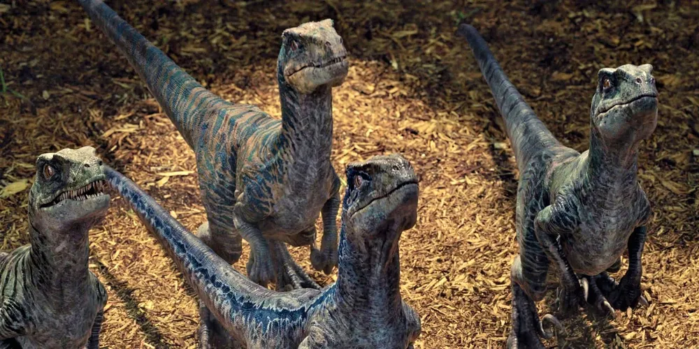
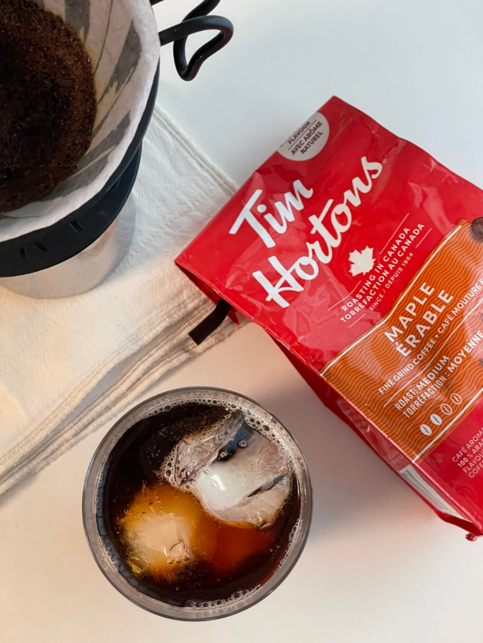

[](https://classroom.github.com/a/74LBcwD_)
# 유레카 1분반 3팀의 활동 보고서 입니다.

## 1️⃣ 팀원 소개

| **이름** | **전공** | **관심사** | **그 외** |
|----------|----------|-------------|------------|
| **김세인** | 소프트웨어전공 | 웹개발, 프로그래밍 | ENTP, 스포츠(야구, 축구 등) |
| **김푸름** | 소프트웨어전공 | 백엔드 | ENTP, 여행(러시아, 일본, 베트남 등) |
| **이송하** | 소프트웨어전공 | 인공지능(경량화, CV), 로보틱스 | INTP, 게임 |


### 팀 슬로건
미래를 예측하는 가장 좋은 방법은 미래를 창조하는 것이다.<br/>
의미: 한 치 앞도 예상할 수 없는 우리의 미래,우리가 만들어나가자!

정한 이유: 급변하는 21세기에, 휘둘리지 않고 우리가 만들어 나가기 위함입니다.<br/>
### 팀 소개
우리의 각오!<br/>
김세인: 저의 미래 진로에 대해 효율적으로 계획하고 반드시 쟁취하겠습니다.<br/>
김종건: <br/>
김푸름: 팀장으로서 팀원들을 잘 이끌고, 반드시 A+를 받아내도록 하겠습니다.<br/>
이송하: 노장의 노련함으로, 한 학기동안 노력하겠습니다..!<br/>


***

## 2️⃣ 공통된 관심사 : 여행, 백엔드, 인공지능
여행: 그리스, 이탈리아 << 김세인님이 다녀오심, 김푸름님이 굉장히 부러워하심


공룡 << 김푸름님이 좋아하심.. 특히 벨로시랩터 좋아한다고 하십니다<br/> 
<div markdown="1">
   <br/>  
</div>

커피 << 이송하님이 좋아하심.. 특히 이번에 구매한 메이플향 나는 원두를 좋아합니다<br/>



***
## 학교에서 제공 받을 수 있는 기회들
노트북 대여, 학생회가 제공하는 빌릴게 서비스<br/>
도서관 리모델링을 해서 굉장히 깨끗하고 좋습니다.

**동아리**
ai 동아리, 백엔드 프론트엔드 <- koss, wink , 두음<br/>
aim, 중앙 ai 동아리<br/>
foscar, 쿠도스

**대외활동**
다른학교랑 진행하는 해커톤(숙명여대), 동계 방학 때쯤에 타대학교랑 aws 대회가 있습니다.<br/>
하계, 동계에 해외 인턴십을 보내줌(실리콘밸리?) << 김혁만 교수님이 홍보를 하셨던 기억이...

**취업 관련**
취업 관련 동문 릴레이 특강(대기업 중견기업에서 멘토분들이 오셔서 강의 진행하십니다)

경력개발지원단 - 국민대학교<br/>
https://career.kookmin.ac.kr/


## 3️⃣ 한학기 동안의 활동 내역 
# 📌 3주차 보고서

## Mission 1: 이정문 화백의 작품을 보고...

### 현재 실현된 기술
- 작품 속 상상은 미래지향적이었으나, 대부분의 기술들이 오늘날 이미 현실에서 구현되고 있음.  
- 특히 디스플레이, 통신 기술, 스마트 디바이스 등이 일상 속에 자리 잡아 가고 있음.
---
- **달로 가는 수학여행**: 날 수 있는 자동차나 우주선 여행 정도로 발달하지 않았을 뿐이지, 탑승형 드론이나 SpaceX의 재사용 우주선 등의 교통 기술은 이미 만들어지고 있음.
- **원격 의료**: 현재는 일반적인 영상통화를 넘어서, Zoom, 구글 클래스룸 등과 같이 화상 통화와 실시간 상호작용을 동시에 할 수 있는 기술도 존재함. 그러나 비대면의 한계점으로 인해 장거리 회의 혹은 영상 통화 등의 목적 외에는 거의 사용이 되지 않고 있음.

### 느낀점
- **김세인**: 60년 전에 예상한 미래의 모습이고, 당시에는 비현실적이었을 것이지만, 현재 발명되었거나 발명 단계에 있는 기술들이 많기 때문에 기술 발전이 매우 빠르게 이루어지고 있다고 생각합니다.
이러한 빠른 발전에는 사람들의 혁신적인 사고방식이 중요한 역할을 하고 있다고 느꼈습니다.
- **김푸름**: 항상 희망적이고 긍정적인 상상이 현실을 이루는 원동력이라고 생각합니다.  
- **이송하**: 개인이 미래를 이정도로 정확하게 예측했다는 사실이 놀라웠습니다. 아직 기술 완성이 부족한 분야가 있기에 이를 빠르게 개발하고 완성하는 것도 좋지만, 사람을 위하고 사람이 중심이 되는 기술을 개발하는 것이 중요하다고 생각합니다.(LIKE VIBE CODING) 

---

## Mission 2: 영상 3개 시청 후 분석
- Microsoft Future Vision (2011)
- 현실이 된 90년대의 상상  
- 유리와 함께하는 하루 2: 미공개 영상 (Corning Vision 비하인드 스토리)

### 현재 실현된 기술
- **Curved Ultra-wide/Flexible Display**
  - 완전 상용화된 상태로, 삼성의 Z플립 시리즈와 LG의 울트라와이드 모니터가 대표적이다.
  - 한국에서 특히 많이 판매되고 있으며, 전시 및 홍보용으로는 플렉서블 OLED 패널을 활용해 곡면 광고판이나 대형 디스플레이가 설치되고 있다(예: 인천국제공항, 롯데월드타워 전시관).

- **실시간 번역 서비스·기기**
  - 완전 상용화가 이루어졌으며, 일리고, 파파고 미니 같은 휴대용 번역기기가 사용되고 있다.
  - 보급은 여행업계·서비스업계에서 활발하며, 일반 대중은 주로 스마트폰 앱을 통한 번역을 선호한다.
  - 대표 앱으로는 구글 번역, 파파고가 있으며, 스마트폰 보급에 따라 대중화가 가능해졌다. 다만 언어별 정확도와 지연 문제는 여전히 개선이 필요한 부분이다.
 
- **자율주행 자동차**
  - L2 수준은 이미 대중화되었으며, L3는 상용화가 시작되고 L4는 일부 지역에서 시범 운행 중이다.
  - 현재 시판 차량의 대부분은 L2~L2+ 단계(고속도로 차선 유지, 자동 감속 등)를 지원하고 있으며, L5 수준의 완전 자율주행은 아직 연구 단계에 머물러 있다.
  - 그러나 L3 이상 단계에서는 사고 발생 시 책임 주체(운전자 vs 시스템) 명확화가 필요하며, V2X 통신망, 전용차선, 정밀지도 고도화와 같은 인프라가 부족하다.
  - 또한 복잡한 도심 환경에서의 인식·판단 정확도와 눈·비·안개 같은 악천후 조건 대응력 강화가 중요한 과제로 남아 있다.

- **로보틱스**  
  - 기술적, 경제적, 사회적, 법·윤리적 한계로 인해 모든 상황에서 전면적인 도입은 어려움.  
  - 하지만 서비스 제공 및 가사 환경에서는 이미 활용 중.
  - 로봇은 특히 군사 분야에서 다양하게 사용되고 있음. 예를 들어 드론, 사족보행 로봇, 무인 정찰기, 무인 잠수정, 폭발물 탐지·제거 로봇 등의 형태로 발전 중임.
  - 예시: 서빙·응대 로봇, 물류센터 자동화 로봇, 의료·돌봄 로봇(수술, 재활, 돌봄), 가정용 로봇(청소, 반려 등).

- **홀로그램 / AR / VR 제품**  
  - 손, 눈, 음성 제어가 가능한 AR/VR 제품이 상용화 단계에 진입.  
  - 다만 고가로 인해 기업 및 전문 분야 중심으로 사용되고 있음.
  - 모바일 기기인 휴대폰의 상용화 이후, 내장된 자이로스코프 기술을 활용하여 3D 공간을 가상으로 볼 수 있는 VR(가상현실), 그리고 현실 공간에 가상 정보를 접목시켜 상호작용할 수 있는 AR(증강현실) 기술이 개발됨.
  - 콘텐츠 부족과 로컬화 한계도 남아 있음.
  - 예시: Apple사의 Vision Pro와 같은 AR/VR에 특화된 기기, MetaQuest 기기

- **IoT 기반 Touch Dashboard 제품**  
  - 터치 스크린 패널과 원격 모니터링 대시보드를 통해 스마트 기기를 제어하는 방식이 상용화.  
  - 특히 신축 아파트의 IoT 시스템에 적극적으로 적용되고 있음.  
  - 그러나 네트워크 안정성, 보안 문제, 기기 호환성, 설치 난이도 등으로 인해 부분적 도입 수준에 머물러 있음.  

### 느낀점
- **김세인**: 현재 로봇, 전자기기와 같은 기술들이 더 이상 미래의 발명품이 아닌, 우리가 실제로 사용하고 있는 현실의 기술이라는 사실이 매우 놀랍습니다. 이러한 기술들이 가능해진 것은 그 발명품을 만들어낸 혁신가들의 노력 덕분이며, 그 결과로 현재의 세계가 만들어졌다고 생각합니다.
- **김푸름**: (Corning Vision 관련) 유리를 끊임없이 IT 기술과 연결하는 모습이 인상 깊었습니다.  
- **이송하**: 이정문 화백의 작품보다 현대적이고 실현 가능성이 높은 기술들이 많았다고 생각합니다. 일부 기술은 이미 완성 단계에 있지만, 비용과 확장성 문제로 상용화에 제약이 있어 앞으로 우리가 해결해야 할 과제라고 느꼈습니다.  

# 📌 4주차 보고서
## sixth sense project

1. MIT Sixth Sense project
    1. **what**: wearable, 제스처를 인식하
                 여 현실 세계와 디지털 세계
                 를 융합하는 프로젝트.
    3. **why**: 인터넷, 컴퓨터 기술들을 직관
                적으로 기술에 다가가게 하기 위
                해서.
    6. **how**: 프로젝터나 카메라, 센서를 통
                해 현실세계와 디지털세계 사이
                에서 상호작용을 하는 방법을 이
                용하였다.
2. As-Is vs To-Be는 어떻게? 기존 컴퓨터의 입력 출력 장치는 어떤 식으로 변형되었는가?
    1. 키보드, 마우스, 모니터
        1. 기존:
            2. sixth sense project: 
        입력: 카메라, 센서를 통해 디지털 세계
             에 입력을 함. 기존 볼 마우스에서
             track ball을 개조하여 데이터 입
             력을 할 수 있도록...
        출력: 빔프로젝터를 통해 출력된 영상과 
              interaction을 함.
        ex) 종이나 손바닥에 프로젝트를 하고, 특
            정 제스처를 통해 입력하는 방법을 이용
            함.
3. MIT Sixth Sense project 팀이 만든 내용이 현재에는 어떻게 구현이 되어 있는가?
       -> 알아보고 적도록 하자….
    


- 기관/부서 인터뷰 ✔️  

- 현장 탐방 ✔️  

- 멘토링 ✔️  
  - 내 지도 교수 함게 만나기
  - 대학원 방문 및 선배 만나기

- 프로젝트 진행 ✔️  
  - 과거에 사람들이 상상한 미래
  - 그들이 만들어가는 세상
  - 우리가 상상한 미래
  - 우리가 그리는 미래 그리고 나

- 각오와 소감 나누기 ✔️  


<!-- 활동 사진 추가 예시 -->


***

## 4️⃣ 인상 깊은 활동

- 활동명 – 활동에 대한 간단한 설명과 배운 점을 작성  
- 예: 멘토링에서 실리콘밸리 현업 경험을 들을 수 있어 진로 방향 설정에 큰 도움이 되었다.  

***

## 5️⃣ 특별히 알아보고 싶은 것
- 예: 현장실습 제도
- 예: TOPCIT 정기평가
- 예: 졸업 후 진로(대학원/취업)

***

## 6️⃣ 활동을 마친 소감

🔗2025 김세인  
> "소감 내용을 여기에 작성합니다."

🔗2025 김종건  
> "소감 내용을 여기에 작성합니다."

🔗2025 김푸름  
> "소감 내용을 여기에 작성합니다."

🔗20215210 이송하  
> "소감 내용을 여기에 작성합니다."


## Markdown을 사용하여 내용꾸미기를 익히세요.

Markdown은 작문을 스타일링하기위한 가볍고 사용하기 쉬운 구문입니다. 여기에는 다음을위한 규칙이 포함됩니다.

```markdown
Syntax highlighted code block

# Header 1
## Header 2
### Header 3

- Bulleted
- List

1. Numbered
2. List

**Bold** and _Italic_ and `Code` text

[Link](url) and 
```

자세한 내용은 [GitHub Flavored Markdown](https://guides.github.com/features/mastering-markdown/).

### Support or Contact

readme 파일 생성에 추가적인 도움이 필요하면 [도움말](https://help.github.com/articles/about-readmes/) 이나 [contact support](https://github.com/contact) 을 이용하세요.

