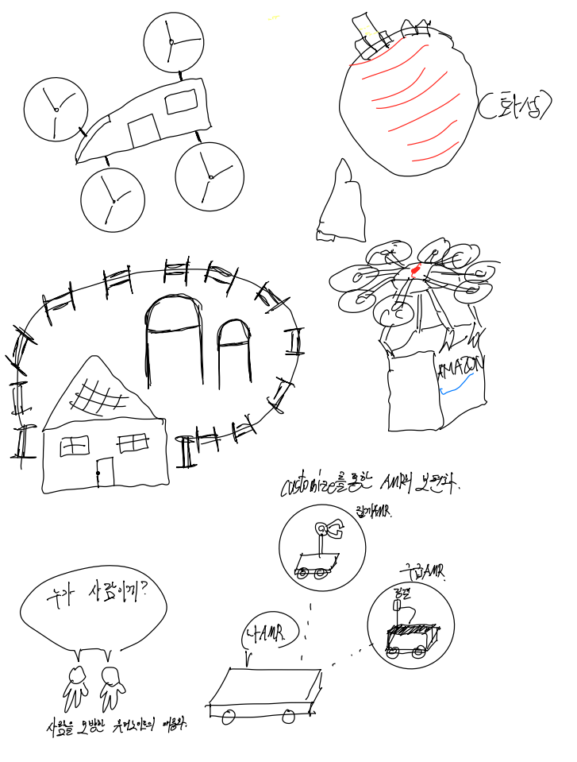
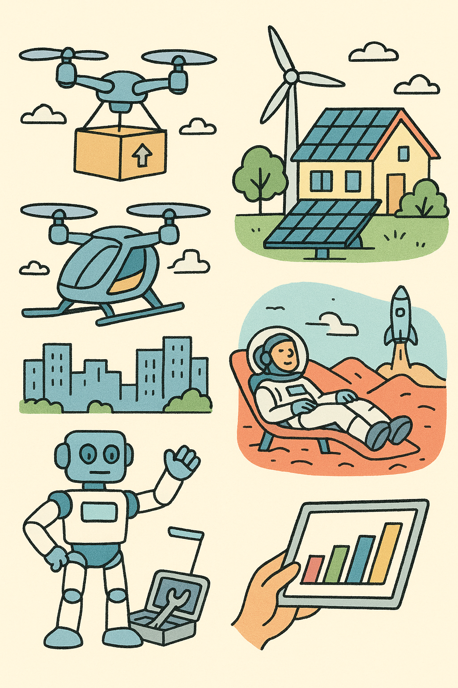

# 유레카 1분반 3팀의 활동 보고서 입니다.

## 1️⃣ 팀원 소개

| **이름** | **전공** | **관심사** | **그 외** |
|----------|----------|-------------|------------|
| **김세인** | 소프트웨어전공 | 웹개발, 프로그래밍 | ENTP, 스포츠(야구, 축구 등) |
| **김푸름** | 소프트웨어전공 | 백엔드 | ENTP, 여행(러시아, 일본, 베트남 등) |
| **이송하** | 소프트웨어전공 | 인공지능(경량화, CV), 로보틱스 | INTP, 게임 |

### 팀 슬로건
미래를 예측하는 가장 좋은 방법은 미래를 창조하는 것이다. 
의미: 한 치 앞도 예상할 수 없는 우리의 미래,우리가 만들어나가자!

정한 이유: 급변하는 21세기에, 휘둘리지 않고 우리가 만들어 나가기 위함입니다. 
### 팀 소개
우리의 각오! 
김세인: 저의 미래 진로에 대해 효율적으로 계획하고 반드시 쟁취하겠습니다. 
김종건:  
김푸름: 팀장으로서 팀원들을 잘 이끌고, 반드시 A+를 받아내도록 하겠습니다. 
이송하: 노장의 노련함으로, 한 학기동안 노력하겠습니다..! 

***

## 2️⃣ 공통된 관심사 : 여행, 백엔드, 인공지능
여행: 그리스, 이탈리아 << 김세인님이 다녀오심, 김푸름님이 굉장히 부러워하심

  
🐉공룡 << 김푸름님이 좋아하심.. 특히 벨로시랩터 좋아한다고 하십니다.

    

         
    

 

  
☕커피 << 이송하님이 좋아하심.. 특히 이번에 구매한 메이플향 나는 원두를 좋아합니다.

    

         
    

 

***
## 학교에서 제공 받을 수 있는 기회들
노트북 대여, 학생회가 제공하는 빌릴게 서비스 
도서관 리모델링을 해서 굉장히 깨끗하고 좋습니다.

**동아리**
ai 동아리, 백엔드 프론트엔드 <- koss, wink , 두음 
aim, 중앙 ai 동아리 
foscar, 쿠도스

**대외활동**
다른학교랑 진행하는 해커톤(숙명여대), 동계 방학 때쯤에 타대학교랑 aws 대회가 있습니다. 
하계, 동계에 해외 인턴십을 보내줌(실리콘밸리?) << 김혁만 교수님이 홍보를 하셨던 기억이...

**취업 관련**
취업 관련 동문 릴레이 특강(대기업 중견기업에서 멘토분들이 오셔서 강의 진행하십니다)

경력개발지원단 - 국민대학교 
https://career.kookmin.ac.kr/

## 3️⃣ 한학기 동안의 활동 내역 
# 📌 3주차 보고서

## Mission 1: 이정문 화백의 작품을 보고...

### 현재 실현된 기술
- 작품 속 상상은 미래지향적이었으나, 대부분의 기술들이 오늘날 이미 현실에서 구현되고 있음.  
- 특히 디스플레이, 통신 기술, 스마트 디바이스 등이 일상 속에 자리 잡아 가고 있음.
---
- **달로 가는 수학여행**: 날 수 있는 자동차나 우주선 여행 정도로 발달하지 않았을 뿐이지, 탑승형 드론이나 SpaceX의 재사용 우주선 등의 교통 기술은 이미 만들어지고 있음.
- **원격 의료**: 현재는 일반적인 영상통화를 넘어서, Zoom, 구글 클래스룸 등과 같이 화상 통화와 실시간 상호작용을 동시에 할 수 있는 기술도 존재함. 그러나 비대면의 한계점으로 인해 장거리 회의 혹은 영상 통화 등의 목적 외에는 거의 사용이 되지 않고 있음.

### 느낀점
- **김세인**: 60년 전에 예상한 미래의 모습이고, 당시에는 비현실적이었을 것이지만, 현재 발명되었거나 발명 단계에 있는 기술들이 많기 때문에 기술 발전이 매우 빠르게 이루어지고 있다고 생각합니다.
이러한 빠른 발전에는 사람들의 혁신적인 사고방식이 중요한 역할을 하고 있다고 느꼈습니다.
- **김푸름**: 과거 사람들이 상상한 미래의 모습이 지금 현실이 되었다는 점이 신기했습니다. 기술의 빠른 발전 속도뿐 아니라, 그 안에서 인간의 편리함과 행복을 추구하려는 노력도 알아볼 수 있었습니다. 또, 미래를 상상하는 일 자체가 새로운 혁신의 출발점이라는 생각이 들었습니다. 항상 희망적이고 긍정적인 상상이 현실을 이루는 원동력이라고 생각합니다.
- **이송하**: 개인이 미래를 이정도로 정확하게 예측했다는 사실이 놀라웠습니다. 아직 기술 완성이 부족한 분야가 있기에 이를 빠르게 개발하고 완성하는 것도 좋지만, 사람을 위하고 사람이 중심이 되는 기술을 개발하는 것이 중요하다고 생각합니다.(LIKE VIBE CODING) 

---

## Mission 2: 영상 3개 시청 후 분석
- Microsoft Future Vision (2011)
- 현실이 된 90년대의 상상  
- 유리와 함께하는 하루 2: 미공개 영상 (Corning Vision 비하인드 스토리)

### 현재 실현된 기술
- **Curved Ultra-wide/Flexible Display**
  - 완전 상용화된 상태로, 삼성의 Z플립 시리즈와 LG의 울트라와이드 모니터가 대표적이다.
  - 한국에서 특히 많이 판매되고 있으며, 전시 및 홍보용으로는 플렉서블 OLED 패널을 활용해 곡면 광고판이나 대형 디스플레이가 설치되고 있다(예: 인천국제공항, 롯데월드타워 전시관).

- **실시간 번역 서비스·기기**
  - 완전 상용화가 이루어졌으며, 일리고, 파파고 미니 같은 휴대용 번역기기가 사용되고 있다.
  - 보급은 여행업계·서비스업계에서 활발하며, 일반 대중은 주로 스마트폰 앱을 통한 번역을 선호한다.
  - 대표 앱으로는 구글 번역, 파파고가 있으며, 스마트폰 보급에 따라 대중화가 가능해졌다. 다만 언어별 정확도와 지연 문제는 여전히 개선이 필요한 부분이다.
 
- **자율주행 자동차**
  - L2 수준은 이미 대중화되었으며, L3는 상용화가 시작되고 L4는 일부 지역에서 시범 운행 중이다.
  - 현재 시판 차량의 대부분은 L2~L2+ 단계(고속도로 차선 유지, 자동 감속 등)를 지원하고 있으며, L5 수준의 완전 자율주행은 아직 연구 단계에 머물러 있다.
  - 그러나 L3 이상 단계에서는 사고 발생 시 책임 주체(운전자 vs 시스템) 명확화가 필요하며, V2X 통신망, 전용차선, 정밀지도 고도화와 같은 인프라가 부족하다.
  - 또한 복잡한 도심 환경에서의 인식·판단 정확도와 눈·비·안개 같은 악천후 조건 대응력 강화가 중요한 과제로 남아 있다.

- **로보틱스**  
  - 기술적, 경제적, 사회적, 법·윤리적 한계로 인해 모든 상황에서 전면적인 도입은 어려움.  
  - 하지만 서비스 제공 및 가사 환경에서는 이미 활용 중.
  - 로봇은 특히 군사 분야에서 다양하게 사용되고 있음. 예를 들어 드론, 사족보행 로봇, 무인 정찰기, 무인 잠수정, 폭발물 탐지·제거 로봇 등의 형태로 발전 중임.
  - 예시: 서빙·응대 로봇, 물류센터 자동화 로봇, 의료·돌봄 로봇(수술, 재활, 돌봄), 가정용 로봇(청소, 반려 등).

- **홀로그램 / AR / VR 제품**  
  - 손, 눈, 음성 제어가 가능한 AR/VR 제품이 상용화 단계에 진입.  
  - 다만 고가로 인해 기업 및 전문 분야 중심으로 사용되고 있음.
  - 모바일 기기인 휴대폰의 상용화 이후, 내장된 자이로스코프 기술을 활용하여 3D 공간을 가상으로 볼 수 있는 VR(가상현실), 그리고 현실 공간에 가상 정보를 접목시켜 상호작용할 수 있는 AR(증강현실) 기술이 개발됨.
  - 콘텐츠 부족과 로컬화 한계도 남아 있음.
  - 예시: Apple사의 Vision Pro와 같은 AR/VR에 특화된 기기, MetaQuest 기기

- **IoT 기반 Touch Dashboard 제품**  
  - 터치 스크린 패널과 원격 모니터링 대시보드를 통해 스마트 기기를 제어하는 방식이 상용화.  
  - 특히 신축 아파트의 IoT 시스템에 적극적으로 적용되고 있음.  
  - 그러나 네트워크 안정성, 보안 문제, 기기 호환성, 설치 난이도 등으로 인해 부분적 도입 수준에 머물러 있음.  

### 느낀점
- **김세인**: 현재 로봇, 전자기기와 같은 기술들이 더 이상 미래의 발명품이 아닌, 우리가 실제로 사용하고 있는 현실의 기술이라는 사실이 매우 놀랍습니다. 이러한 기술들이 가능해진 것은 그 발명품을 만들어낸 혁신가들의 노력 덕분이며, 그 결과로 현재의 세계가 만들어졌다고 생각합니다.
- **김푸름**: Corning Vision 영상을 통해 유리가 단순한 재료가 아니라, IT 기술과 결합해 미래 사회를 바꾸는 핵심 소재로 발전하고 있다는 점이 인상 깊었습니다. 특히 투명 디스플레이나 스마트 윈도우처럼 일상 속에서 기술이 자연스럽게 스며드는 모습이 흥미로웠습니다. 앞으로도 기술이 인간의 삶을 더 편리하고 따뜻하게 변화시키는 방향으로 발전하길 기대합니다.
- **이송하**: 이정문 화백의 작품보다 현대적이고 실현 가능성이 높은 기술들이 많았다고 생각합니다. 일부 기술은 이미 완성 단계에 있지만, 비용과 확장성 문제로 상용화에 제약이 있어 앞으로 우리가 해결해야 할 과제라고 느꼈습니다.  

---

# 📌 4주차 보고서
## sixth sense project

1. MIT Sixth Sense project
    1. **what**: wearable, 제스처를 인식하여 현실 세계와 디지털 세계를 융합하는 프로젝트.
    3. **why**: 인터넷, 컴퓨터 기술들을 직관적으로 기술에 다가가게 하기 위해서.
    6. **how**: 프로젝터나 카메라, 센서를 통해 현실세계와 디지털세계 사이에서 상호작용을 하는 방법을 이용하였다.
2. As-Is vs To-Be는 어떻게? 기존 컴퓨터의 입력 출력 장치는 어떤 식으로 변형되었는가?
    1. 키보드, 마우스, 모니터
        1. 기존:
            2. sixth sense project: 
        입력: 카메라, 센서를 통해 디지털 세계
             에 입력을 함. 기존 볼 마우스에서
             track ball을 개조하여 데이터 입
             력을 할 수 있도록...
        출력: 빔프로젝터를 통해 출력된 영상과 
              interaction을 함.
        ex) 종이나 손바닥에 프로젝트를 하고, 특
            정 제스처를 통해 입력하는 방법을 이용
            함.
3. MIT Sixth Sense project 팀이 만든 내용이 현재에는 어떻게 구현이 되어 있는가?
       -> 알아보고 적도록 하자….
    

# 📌 5주차 보고서
## 우리가 상상한 미래
### 2040, 2050 모습을 상상하고 그림으로 그리기
| Figure 1 — Draft | Figure 2 — Final |
|---|---|
|  |  |

## 설명
## **김세인** 
🚁 드론 배송 (Drone Delivery)
드론 배송은 하늘을 나는 소형 무인 항공기(드론)를 이용해 상품을 빠르고 효율적으로 전달하는 미래형 물류 서비스다.
지상 교통의 혼잡을 피하고 인건비와 시간을 절약할 수 있어, 도시와 농촌, 도서 지역 등 다양한 환경에서 활용이 기대된다.

2000년대 후반 드론이 상용화되면서 개인용·군사용·탑승형 등 다양한 분야가 발전했고, 이후 드론을 이용한 택배 아이디어가 본격적으로 등장했다.
이후 구글, 아마존 등 글로벌 기업들이 연구에 참여하면서 상용화 경쟁이 시작됐다.

✅ 주요 동향
📦 아마존 프라임 에어(Prime Air) — 2022년부터 일부 지역에서 시험 운행을 시작. AI 기반 항로 제어와 자동 장애물 회피 기술을 적용해 빠르고 정확한 배송을 목표로 한다.
🚚 구글 윙(Google Wing) — 호주와 미국 일부 지역에서 드론 배송을 시범 서비스 중. 의약품, 음식 등 소형 상품 중심.
🌏 국가 차원의 시도 — 여러 나라가 드론 배송 상용화를 위한 항공 규제 완화, 인증 제도 개선, 도심 내 비행 허용구역 설정을 추진하고 있다.

하지만 드론 배송의 대중화는 아직 쉽지 않다.
비용, 배터리 한계, 배송 가능 지역의 제약, 소음, 그리고 안전 규정 문제 등 기술적·법적 장벽이 여전히 높다.

⚙️ 기술 발전 요소
✅ 자율비행 및 항로 인공지능 기술
🔋 고효율 배터리·경량화 설계
📡 초정밀 GPS 및 실시간 비행 제어
🛰️ 항공 교통 관리(UTM) 시스템 개발

🔮 미래 전망
2030년대 중반에는 도심 내 “하늘 물류망”이 구축되어, 30분 내 배송이 일상이 될 가능성이 높다.
드론은 재난 구호, 응급 의료물품 수송, 농업 관리 등 다양한 공공 서비스로 확장될 것이며,
“하늘길 물류 혁명”의 중심이 될 것으로 예상된다.

🚀 화성 여행 (Mars Travel)
화성 여행은 지구 밖 인류 거주 가능성을 실현하기 위한 핵심 프로젝트로, 인류의 우주 이주 시대를 여는 중요한 시도다.

지구와 가장 비슷한 환경을 가진 행성인 화성은 대기, 방사선, 온도, 기압 등 생존 조건이 매우 열악하지만,
테라포밍(행성 개조)과 재사용 가능한 로켓 기술의 발전으로 접근성이 점차 개선되고 있다.

✅ 주요 기업 및 기술 동향
🛰️ SpaceX — 2006년 팔콘 1 발사 이후 11번째 성공적 비행을 달성했으며, 현재는 초대형 로켓 스타십(Starship) 개발 및 귀환 성공으로 화성 이주 기반을 다지고 있다.
💰 비용 혁신 — 스타십 발사 비용은 약 9천만 달러 수준으로, 과거 아폴로 1호의 10억 달러 대비 90% 이상 절감.
🌌 테라포밍 연구 — 대기 조성 변화, 온실가스 활용, 인공 자기장 형성 등 화성 환경을 인간 거주에 적합하게 만드는 연구가 진행 중이다.

🏗️ 미래 비전
SpaceX는 향후 수십 년 내에 화성에 식민지를 건설하고, 자원 채굴·관광·연구를 병행하는 **“화성 생태 도시”**를 목표로 한다.
이 계획은 단순한 탐사가 아니라 인류의 지속 가능한 행성 확장 전략의 일환으로 평가된다.

🌈 기대 효과

지구 인구 과밀 및 자원 문제 완화

새로운 관광·우주 산업 창출

인류의 다행성 생존 기반 구축

💡 현재의 한계

화성의 극저온과 낮은 대기압

강한 방사선 환경

장기 체류 인프라 및 생명 유지 기술의 부족

🌠 미래의 가능성
기술이 지속적으로 발전함에 따라, 언젠가는 “화성행”이 선택 가능한 여행 코스가 될 수도 있다.
지금의 연구는 그 첫걸음이며, 인간이 지구 너머의 세계로 확장하는 시대를 예고하고 있다.

## **김푸름** 
### 🚕 플라잉 택시 (Flying Taxi)

플라잉 택시는 하늘을 나는 **전기 드론형 택시**로, 도심의 교통 체증 없이 빠르게 이동할 수 있는 미래형 교통수단이다.  
AI가 **최적의 경로를 계산**해 자율주행하며, **수직으로 이착륙(VTOL)**이 가능하다.

현재는 시험 운항과 제도 정비 단계이지만, 2030년대 중반부터는 주요 도시에 상용 노선이 생기고
2050년에는 사람들이 하늘길을 따라 자유롭게 이동하는 시대가 될 것이다.  
이미 여러 나라에서 시험 비행에 성공하며, 실제로 하늘을 나는 수준까지 발전했다.

---
### ✅ 주요 동향
- 🚀 영국 버티컬 에어로스페이스의 VX4가 일반 비행 구역에서 조종사 탑승 비행에 성공했으며, 2028년 상용화를 목표로 한다.
- 🛫 ANA-조비는 오사카·간사이 엑스포에서 eVTOL ‘조비 S4’ 시범 비행을 진행하고, 일본 내 eVTOL 상용화를 위한 에코시스템 구축을 추진하고 있다.
- 🏙️ 중국은 이항의 EH216-S가 상업 운영에 필요한 4가지 인증서를 모두 획득했고, 유인 UAM 감항인증도 확보해 여객·응급 등 상용화를 준비 중이다.
- 🏅 프랑스 파리 올림픽 기간에는 볼로콥터 ‘볼로시티’ 시험 운행이 승인됐으나 아직 일반인 이용은 제한적이다.
- 🌏 우리나라 역시 현대자동차와 한화시스템이 참여한 UAM 프로젝트를 통해 2028년 시범 운항을 목표로 하고 있으며, 인천공항과 도심을 잇는 버티포트 구축 계획이 추진되고 있다.

---

### ✈️ eVTOL 기술 발전

**전기 수직이착륙기(eVTOL)**는 다음과 같은 특징을 가진다:

- ✅ **자율비행 및 AI 항로 제어기술** 향상  
- 🔇 **저소음 프로펠러 기술** 적용  
- 🔋 **고효율 배터리 시스템 및 경량화 소재** 개발

- AI는 실시간 기상 정보와 교통 데이터를 분석해 가장 안전하고 효율적인 경로를 계산하며, 5G·위성 통신으로 지상 관제    시스템과 연결된다. 또한 리튬황·고체 배터리 기술의 도입으로 장거리 운항이 가능해지고 있다.
- 현재 **미국의 Joby, Archer, 보잉 계열 Wisk** 등이 상용화를 목표로 실증 비행을 진행 중이다.

---

### 🌍 세계 각국의 준비

각국 정부는 플라잉 택시 시대를 대비해  
다음과 같은 인프라와 제도를 준비하고 있다:

- 🛫 **이착륙장(버티포트)** 구축  
- 📜 **항공 법규 및 인증 절차** 정비  
- 🤝 **민관 협력 프로젝트** 확대

- 플라잉 택시는 단순한 교통수단을 넘어, 도심 교통 혼잡 완화·응급 이송·재난 구조 등 다양한 분야에서 활용될 수 있
  **도심형 항공 서비스(UAM)**의 핵심 기술될 것이다.
  
---
### 🌈 미래의 하늘길

머지않은 미래, 사람들은 도로 대신 하늘길을 통해 출근하고, 여행하며, 친구를 만나게 될 것이다.
플라잉 택시는 이동의 개념을 바꾸는 동시에 도시의 구조와 인간의 생활 방식까지 변화시킬 것이다.
하늘 위에서 이어지는 새로운 길, 그것이 플라잉 택시가 열어갈 미래이다.

---
## **이송하** 
### 🤖 로보틱스 – 휴머노이드 & AMR 🤖

## 미래상  
- 사람과 거의 동일한 기능과 모습을 가진 **휴머노이드 로봇**이 대중화되어,  
  가정, 사무실, 매장 등 어디에서든 볼 수 있게 된다.  
- 상황이나 개인의 필요에 맞춘 **맞춤형 AMR(자율이동로봇, Autonomous Mobile Robot)**이 일반화되어,  
  창고·물류·제조뿐 아니라 가정·배송·서비스 환경까지 확장된다.  
- 이를 뒷받침하는 인프라도 갖춰진다: 예컨대 뒷마당에 설치된 **개인 주택용 미니 원자력 발전소**가 전력 공급을 책임지며,  
  로봇 운영에 필요한 고밀도 배터리 충전, 초고속 통신(5G/6G), 엣지 AI 서버 등이 집 안팎에 구축된다.

---

### ✅ 시장 동향 및 기술 진전  
- 휴머노이드 로봇 시장은 매우 빠른 성장세를 보이고 있다.  
  예컨대 글로벌 휴머노이드 로봇 시장 규모는 **2024년 약 32.8 억 달러**에서 **2032년 약 660 억 달러**로 성장할 것으로 예측된다. (연평균성장률 약 45.5 %)
- AMR 시장 또한 활발하다. 2024년 기준 약 40.7 억 달러 규모였으며 2030년까지 약 95.6 억 달러로 확대될 것으로 전망된다. (연평균성장률 약 15.1%)
- 휴머노이드 로봇은 초기에는 창고·물류·제조환경에 도입되고 있으며, 향후에는 가정·서비스·돌봄용으로 확대될 조짐이 보인다.
- 나아가 로봇이 동작하고 자율적으로 충전·관리할 수 있도록 관련 인프라도 발전 중이다. 고속 통신망, 엣지 AI, 자율충전 스테이션 등

---

### 🏠 인프라 변화  
- 개인 주택 수준에서 고밀도 로봇과 스마트 인프라를 운영하기 위해서는 안정적인 전력 공급과 충전 인프라가 필수다.  
  이로 인해 **소형 원자력 발전소(micro-nuclear or small modular reactor, SMR)** 개념이 연구되고 있으며, 주거 단위 혹은 커뮤니티 단위로 설치 가능성이 논의되고 있다.  
- 또한 로봇이 집 안팎을 자유롭게 이동하려면 초고속 통신(5G/6G), 로컬 엣지 서버, 스마트 홈 통합 플랫폼 등이 필요하며, 이는 곧 “로봇 친화형 주택” 설계로 이어진다.  
- 로봇의 자율 운영을 위해 전력망과 로봇 충전 스테이션, 자율충전 시스템이 가정 내·외부에 구축될 것이며, 로봇 운영 데이터가 클라우드와 엣지를 넘나들며 실시간 처리된다.

---

### 🔮 미래 전망 및 과제  
- 가까운 미래(2030년대)에는 가정·개인 공간에서도 휴머노이드와 AMR이 일반화될 가능성이 높다.  
- 다만 다음과 같은 과제가 존재한다:  
  - 휴머노이드의 경우 아직 **비용이 높고**, **보행·조작·상호작용 능력**이 인간 수준에 도달하지 못했다.
  - 개인정보·보안·안전 문제: 가정 내 로봇이 개인 데이터를 수집하고 움직이므로 프라이버시·보안 이슈가 중요하다.  
  - 인프라 구축 비용과 제도 정비: 개인 주택용 원자력 발전소나 로봇 충전·관리 인프라는 제도·규제 측면에서 해결이 필요하다.  
  - 로봇과 인간 간 상호작용(HRI)의 고도화가 요구된다.

상용화 여부 
🏎️ [현대위아: 자율주행 물류로봇 AMR 상용화](https://www.hyundai-wia.com/pr/press_view.asp?flag=CAST&gubun=KO&keyIdx=4821)  
🤖 [Tesla: optimus](https://www.youtube.com/watch?v=cpraXaw7dyc) 
연구 동향 
VLA: Vision Language Action model 
RL: Reinforcement Learning 

# 📌 6주차 보고서
## 🎤 멘토님과 인터뷰
5주차에서 정리한 주제를 바탕으로, **현대에 구현된 상용 기술**과 **연구·실증 단계의 기술**에 대해 토론했습니다.  
또한 현업에서의 어려움과 취업 관련 Q&A를 진행했습니다.

### 📝 논의 주제 요약
- 플라잉 택시(eVTOL), 휴머노이드, AMR, AR/VR, 원격의료, 자율주행 등
- 인프라: 초고속 통신(5G/6G), 엣지 AI, 충전·정비 인프라
- 제도: 안전·보안·개인정보·책임소재와 같은 규제 이슈

### 🔎 현재 단계 정리 (상용화 vs 연구·실증)
| 분야 | 상용화(예) | 연구·실증(예) |
|---|---|---|
| 플라잉 택시(eVTOL) | 공항/도심 항공 서비스 준비(제도·인프라 일부 진행) | 다수 기업이 **시험비행·인증** 단계 |
| 휴머노이드 | 파일럿 PoC(물류·제조 현장 일부 데모) | 보행·조작·HRI 고도화, 비용 절감 연구 |
| AMR(자율이동로봇) | 물류창고/공장 **상용 운영** | 가정·서비스 분야 확장, 자율충전/관제 최적화 |
| 원격의료 | 비대면 상담/모니터링 **상용 플랫폼** | 법·책임·데이터 연계 고도화, 원격시술 연구 |
| 자율주행 | L2~L2+ 보급, 일부 L3 시작 | L4 지역 제한 자율주행(지정 구역 실증) |

### 💡 멘토 코멘트: “개인 주택용 원자력” 가능성
- **요지:** 장기적으로 **개인화된 소형 원자력(커뮤니티/주택 단위)**도 가능해질 수 있다.  
  과거 **애니악(ENIAC)**이 방 한 칸을 차지하던 시절에서 오늘의 스마트폰으로 진화한 사례처럼, **소형화·안전성·비용**이 개선되면 전력 인프라도 개인화/분산화가 진행될 수 있다고 하셨다.
- **현 시점의 쟁점(사실 정리):** 안전성, 방사성 폐기물 처리, 규제·책임, 초기 투자·운영비용 등 **해결 과제가 매우 크다**
---

### 📚 우리가 얻은 인사이트
1. **상용화의 핵심은 기술 + 인프라 + 제도**의 동시적인 발전이라고 하셨다.
2. 휴머노이드/AMR은 **물류·제조**에서 먼저 경제성을 증명하고 **가정·서비스**로 확장될 가능성이 크다고 하셨다.
3. eVTOL·자율주행은 **안전·책임·인증** 같은 제도적 요소와 함께 발전할 것이라고 하셨다.
4. “개인 원자력”과 같은, 현재는 납득하기 어려운 기술들이 존재하지만 애니악 컴퓨터의 사례와 같이 언젠가는 해결될 수 있는 기술이라고 하셨다.

---

<!-- 활동 사진 추가 예시 -->

***

## 4️⃣ 인상 깊은 활동

- 활동명 – 활동에 대한 간단한 설명과 배운 점을 작성  
- 예: 멘토링에서 실리콘밸리 현업 경험을 들을 수 있어 진로 방향 설정에 큰 도움이 되었다.  

***

## 5️⃣ 특별히 알아보고 싶은 것
- 예: 현장실습 제도
- 예: TOPCIT 정기평가
- 예: 졸업 후 진로(대학원/취업)

***

## 6️⃣ 활동을 마친 소감

🔗2025 김세인  
> "소감 내용을 여기에 작성합니다."

🔗2025 김종건  
> "소감 내용을 여기에 작성합니다."

🔗2025 김푸름  
> "소감 내용을 여기에 작성합니다."

🔗20215210 이송하  
> "소감 내용을 여기에 작성합니다."

